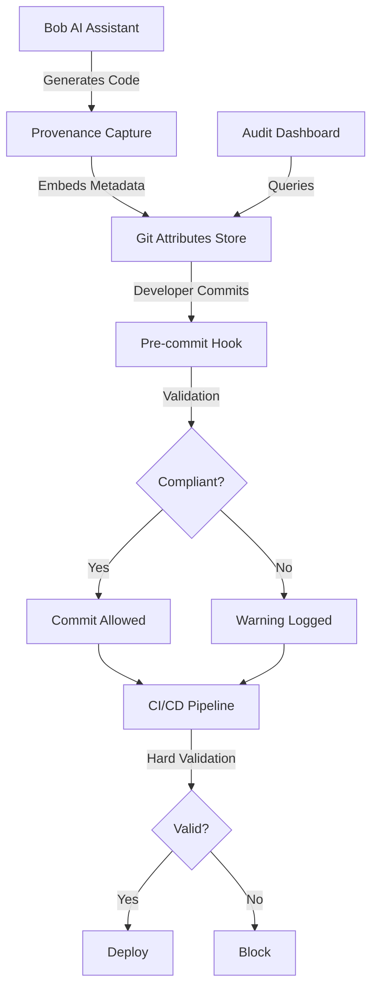

# AI Code Provenance System

> **"Git Blame for AI-Generated Code"**

A comprehensive system to track, validate, and audit AI-generated code for compliance with HIPAA, GDPR, PCI-DSS, and other regulatory frameworks.

---

## 🎯 Problem Statement

**The Challenge:**
- AI-generated code lacks traceability and audit trails
- No way to verify compliance with regulatory requirements
- Unknown security and quality of AI outputs
- No gates to prevent non-compliant code in production
- When auditors ask "Who generated this code?", there's no answer

**Real-World Impact:**
- Healthcare apps with HIPAA violations
- Financial systems with PCI-DSS gaps
- Privacy breaches from GDPR non-compliance
- Legal liability for AI-generated bugs
- Failed compliance audits

---

## 💡 Solution

A multi-stage provenance tracking system with progressive enforcement:

```
Generate  →  Capture silently        (no friction)
Commit    →  Warn and log            (escapable)
CI/CD     →  Hard gate               (absolute)
```

### Key Features

✅ **Automatic Capture** - Transparent provenance tracking during code generation  
✅ **Comprehensive Metadata** - Model, prompt, compliance flags, risk assessment  
✅ **Git-Integrated Storage** - Version-controlled with your code  
✅ **Multi-Stage Enforcement** - Progressive validation from dev to production  
✅ **Compliance-Ready** - Built for HIPAA, GDPR, PCI-DSS audits  
✅ **Developer-Friendly** - Zero friction, clear value proposition  

---

## 🏗️ Architecture

### High-Level Overview



### Core Components

1. **Provenance Capture Layer** - Intercepts AI code generation
2. **Git Attributes Storage** - Version-controlled metadata
3. **Validation Engine** - Multi-stage compliance checks
4. **Audit Dashboard** - Compliance reporting and analytics
5. **CLI Tools** - Query and manage provenance data

---

## 📊 Metadata Schema

Each AI-generated code block captures:

```json
{
  "provenance_id": "uuid-v4",
  "model_info": {
    "name": "gpt-4",
    "version": "2024-05",
    "provider": "openai"
  },
  "generation": {
    "timestamp": "2026-05-02T00:00:00Z",
    "prompt_hash": "sha256-hash",
    "confidence_score": 0.95
  },
  "code_info": {
    "file_path": "src/auth/login.ts",
    "function_name": "authenticateUser",
    "line_range": [45, 78],
    "lines_count": 34,
    "language": "typescript"
  },
  "compliance": {
    "flags": ["HIPAA", "PCI-DSS"],
    "human_review_required": true,
    "policy_version": "v2.1.0",
    "risk_level": "high"
  },
  "validation": {
    "signature": "cryptographic-signature",
    "chain_hash": "previous-hash"
  }
}
```

---

## 🚀 Quick Start

### Installation

```bash
# Install VS Code extension
code --install-extension code-provenance

# Install CLI tool
npm install -g @code-provenance/cli

# Initialize in your project
cd your-project
provenance-cli init
```

### Basic Usage

```bash
# Generate code with Bob (provenance captured automatically)
# No manual steps required!

# Query provenance
provenance-cli query --file src/auth.ts --line 45

# Validate repository
provenance-cli validate --strict

# Generate compliance report
provenance-cli report --format pdf --compliance HIPAA
```

### VS Code Integration

- **Hover** over code to see provenance info
- **Status bar** shows AI code percentage
- **Command palette** for audit operations
- **Inline markers** for critical code

---

## 🎬 Demo Scenario

### Healthcare App Authentication

**Setup:**
1. Healthcare application handling patient data
2. Developer uses Bob to generate authentication code
3. Code must comply with HIPAA

**Workflow:**

```typescript
// Developer asks Bob: "Create a secure authentication function"

// Bob generates code (provenance captured automatically)
export async function authenticateUser(credentials: Credentials) {
  // @ai-provenance: prov-12345
  const hashedPassword = await bcrypt.hash(credentials.password, 10);
  const user = await db.users.findOne({ email: credentials.email });
  
  if (!user || !(await bcrypt.compare(credentials.password, user.password))) {
    throw new UnauthorizedError();
  }
  
  return generateToken(user);
  // @ai-provenance-end: prov-12345
}
```

**Commit Attempt:**
```bash
$ git commit -m "Add authentication"

🔍 Checking AI code provenance...
⚠️  Warning: 1 function requires HIPAA review
   - src/auth.ts:45-78 (authenticateUser)
   
Continue with commit? [y/N] y
📝 Logging provenance warning...
```

**CI/CD Pipeline:**
```bash
$ git push origin main

🔍 Validating AI code provenance...
❌ Deployment blocked: HIPAA review required
   - src/auth.ts:45-78 (authenticateUser)
   
Please complete human review before deployment.
```

**After Review:**
```bash
$ provenance-cli mark-reviewed --file src/auth.ts --line 45 --reviewer john@company.com

✅ Code marked as reviewed
$ git push origin main

🔍 Validating AI code provenance...
✅ All checks passed
🚀 Deploying to production...
```

---

## 🔒 Security & Compliance

### Tamper-Proof Design

- **Cryptographic signatures** on all metadata
- **Chain hashing** links provenance entries
- **Immutable audit log** of all operations
- **Access controls** for sensitive data

### Compliance Coverage

| Regulation | Requirement | Our Solution |
|-----------|-------------|--------------|
| **HIPAA** | Audit trail of PHI access | Track all code touching patient data |
| **GDPR** | Data processing records | Metadata shows AI processing |
| **PCI-DSS** | Change tracking | Git integration provides history |
| **SOX** | Code review evidence | Human review flags |
| **ISO 27001** | Security controls | Risk assessment in metadata |

### Privacy Protection

- **One-way hashing** of prompts (SHA-256)
- **Data minimization** - only essential metadata
- **Encryption at rest** for sensitive fields
- **Access logging** for audit trail
- **GDPR compliance** - right to erasure

---

## 🎯 Value Proposition

### For Developers
- ✅ Protect yourself from AI liability
- ✅ Quick lookup of code origins
- ✅ Personal AI usage analytics
- ✅ Resume-worthy compliance experience

### For Compliance Officers
- ✅ Complete audit trail for AI code
- ✅ Automated compliance reporting
- ✅ Risk assessment and tracking
- ✅ Faster audit completion

### For Organizations
- ✅ Reduce compliance risk
- ✅ Pass regulatory audits
- ✅ Demonstrate due diligence
- ✅ Competitive advantage

### For Auditors
- ✅ Clear provenance trail
- ✅ Tamper-proof evidence
- ✅ Standardized reporting
- ✅ Easy verification

---
### Development Setup

```bash
# Clone repository
git clone https://github.com/your-org/code-provenance.git
cd code-provenance

# Install dependencies
npm install

# Run tests
npm test

# Build extension
npm run build

# Run in development mode
npm run dev
```

## 📄 License

MIT License - see [LICENSE](./LICENSE) for details

---

## 🎉 Let's Build the Future of AI Code Compliance!

**Star this repo** if you believe AI code needs provenance tracking!

**Join the discussion** to help shape the future of this project!

**Contribute** to make this an industry standard!

---

*Built with ❤️ for the AI Code Compliance Hackathon*

*"Every line of AI code deserves a story"*